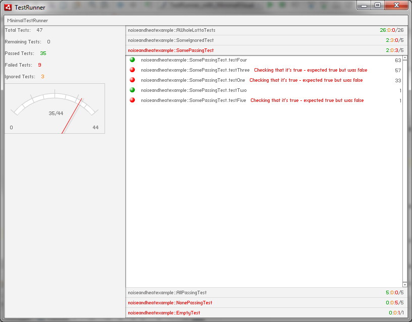

# MinimalVisualListener
Pure AS3 visual listener for FlexUnit based on MinimalComps


(Tests displayed on the sceenshot were shamelessly stolen from https://github.com/mnem/flexunit_visual_listener/tree/master/src-example)

Usage:
------
```actionscript
core = new FlexUnitCore();
var visualListener:MinimalVisualListener = new MinimalVisualListener( stage.stageWidth, stage.stageHeight );
addChild( visualListener );
core.addListener( visualListener );
core.run( TestSuite );
```
